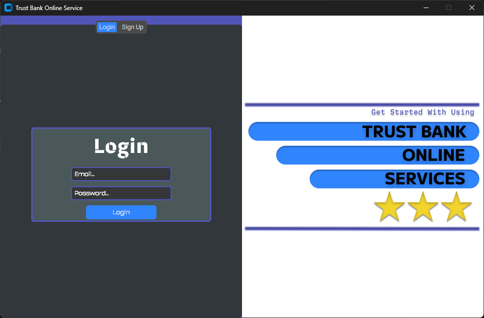
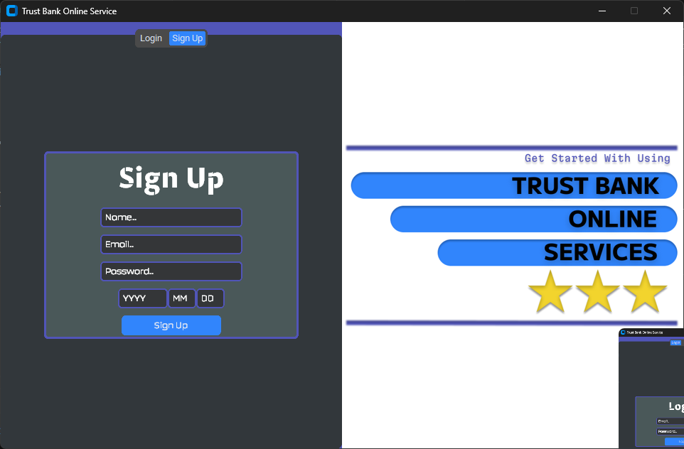
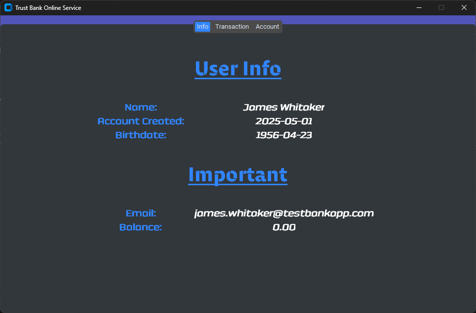
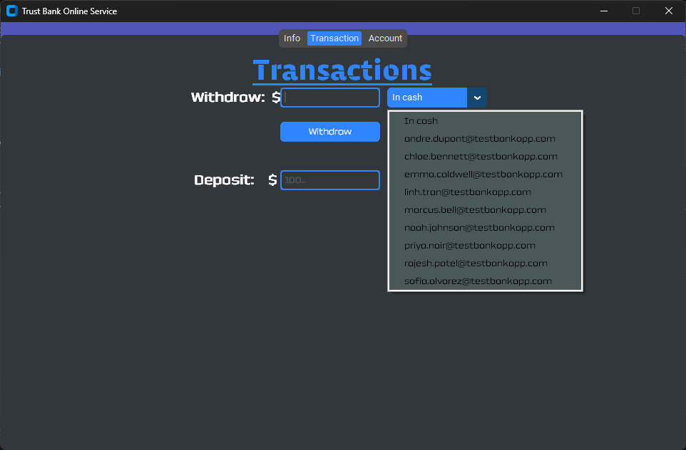
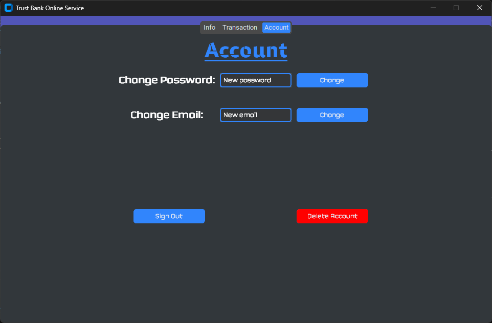

# **Elite 102 Project - Trust Bank Online Service**
 

# **Setup**
- Run the following code in terminal to install all dependencies
    ``` powershell
    pip install -r requirements.txt
    ```

- Additionally you should create a mysql connection by installing mysql workbench and then edit the connection config as needed in **connection_init()** function located in **db_util.py**. The code is as follows shows:
    ``` python
    config = {
        "host": "127.0.0.1",
        "user": "root",
        "password": "password",
    }
    ```
- Finally run **main.py**
- Optionally install the fonts located in the ``` fonts ``` folder
- There might be more things that you might need to tweak to get the app to run locally. Please use the errors as a guide on what you need to do in your case.


# **Features**
- ## **Login Page**
    

- ## Sign Up Page
    

- ## User Info Page
    

- ## Transaction Page
    

- ## Account Settings Page
    

---
### Looking for ways to improve on my code. Thanks for viewing.
